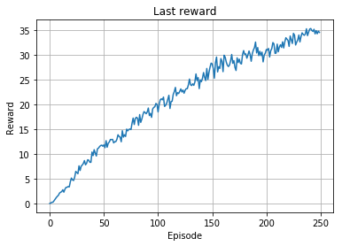
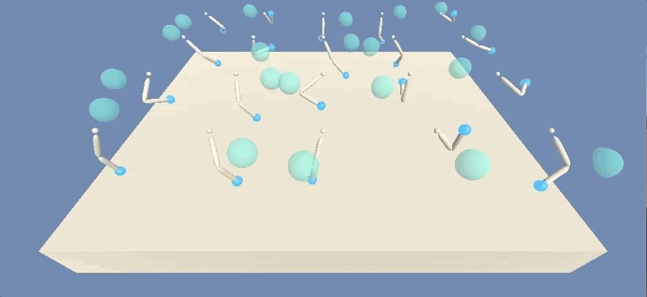
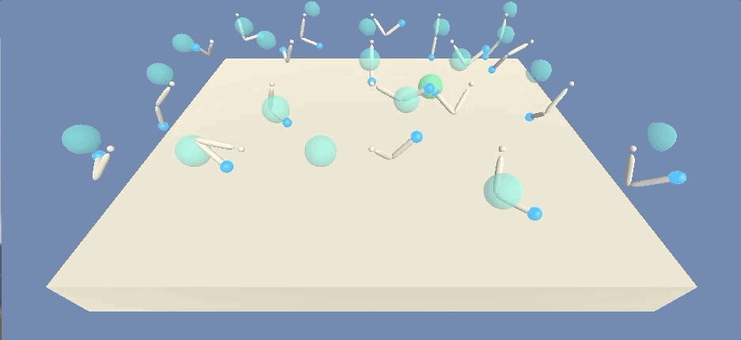
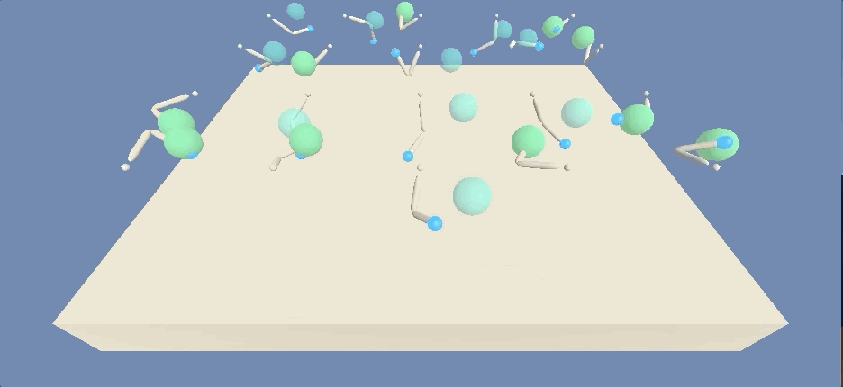
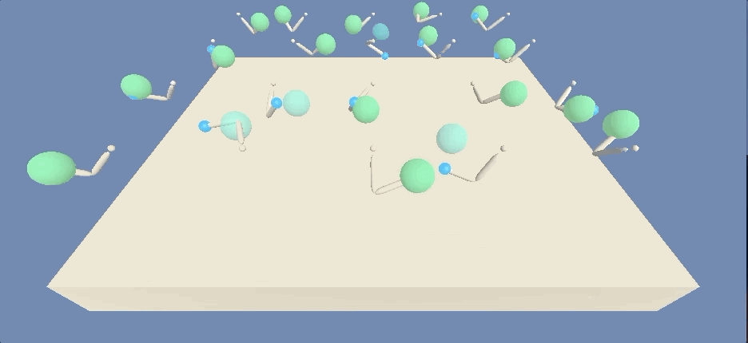

# Project report

## Learning algorithm

The learning algorithm used is Proximal Policy Optimization (PPO) modified for continous action space. The input to the neural network model is observation vector (33 real numbers). The model consists of 2 seperate neural networks - actor and critic which are interfaced with one class `PPOPolicyNetwork`. 

The actor network takes observation as an input and outputs actions. Due to the `tanh` activation function on the output layer there is no need to scale or clip actions to fit -1, 1 range. The critic network is used to compute advantage returns which requires state value estimation. It outputs 1 real number - state value estimate for the given state.

Action probabilites are taken from the normal distribution.

## Parameters and hyperparameters

### Neural networks

The actor network directly outputs action which agent will take and use without any additional clipping, normalizing or preprocession. That's why it outputs 4 values - size of the action space. The critic network is not directly needed for the PPO algorithm (original paper describes policy network and surrogate function which counts ration of new action probabilites to old ones - actor would suffice) but it's very helpful to compute advantages which requires value for state.

The hidden size parameters was choosen after careful tuning. I started from 64 nodes and after every increase agent took less episodes to converge (while also needed more computing power). 

#### Actor network

- 3 fully connected layers
- 33 input nodes [observation vector size], 4 output nodes [action vector size], 512 hidden nodes in each layer
- ReLU activations, tanh on last layer

#### Critic network

- 3 fully connected layers
- 33 input nodes [observation vector size], 1 output nodes, 512 hidden nodes in each layer
- ReLU activations, no activation on last layer

### Main hyperparameters

- Discount rate - `0.99`
- Tau - `0.95`
- Rollout length - `2048`
- Optimization epochs - `10`
- Gradient clip - `0.2`
- Learning rate - `3e-4`

## Results




The second chart shows an average reward over 100 consecutive episodes. It's steadly increasing and reached required `30+` around 240 episode. Last values printed in the console are:

```
Episode: 250 Total score this episode: 34.51249922858551 Last 100 average: 30.996649307170888
```

and this model is saved as `models/ppo-max-hiddensize-512.pth`

## Next steps

- **Hyperparameter tuning** - I focused on tuning hidden size and gradient clip which gave major improvements. Other parameters would probably impact learning and it's worth to check how.
- **DDPG** -  I gave up on DDPG as it was learning *very* slowly. But it would be good to se how it *actualy* compares with PPO, not just how it feels.
- **Try PPO on other environment** - to see if PPO will be still good.
- **Write generic implementation** - to reuse this repository on other problems and with other libraries (like `Gym`).

## GIFS

### Episode ~10



### Episode ~50



### Episode ~100



### Episode ~240




